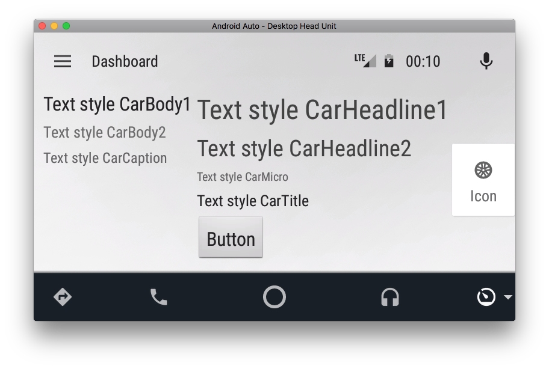
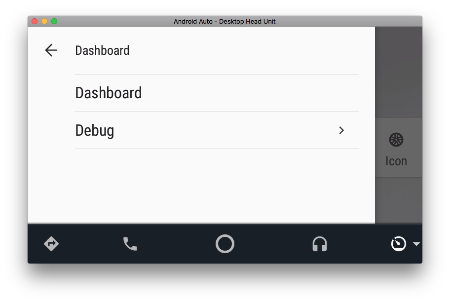
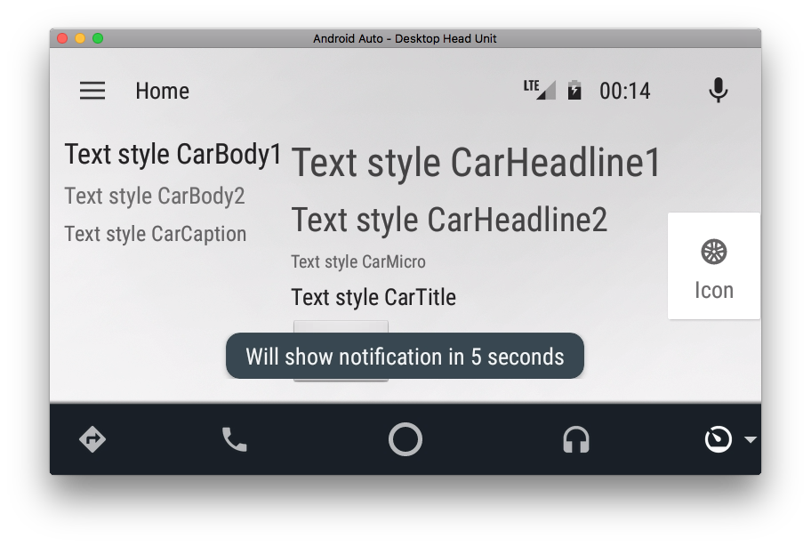
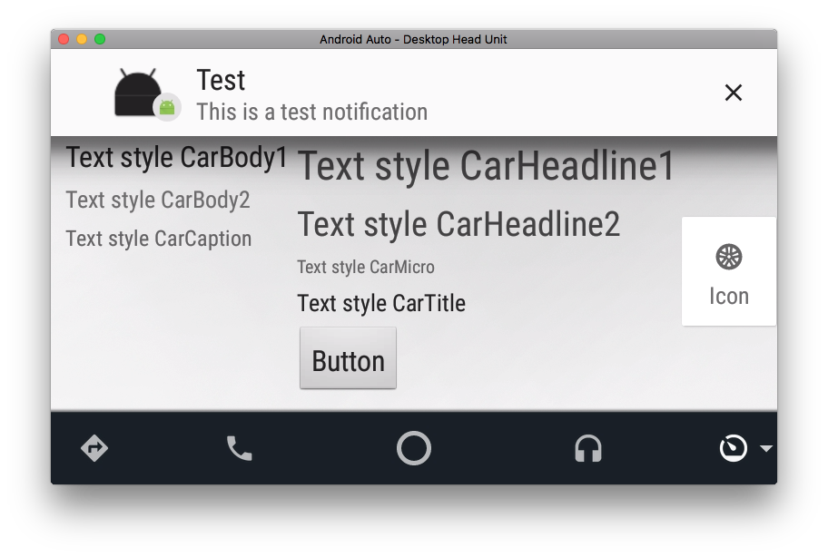
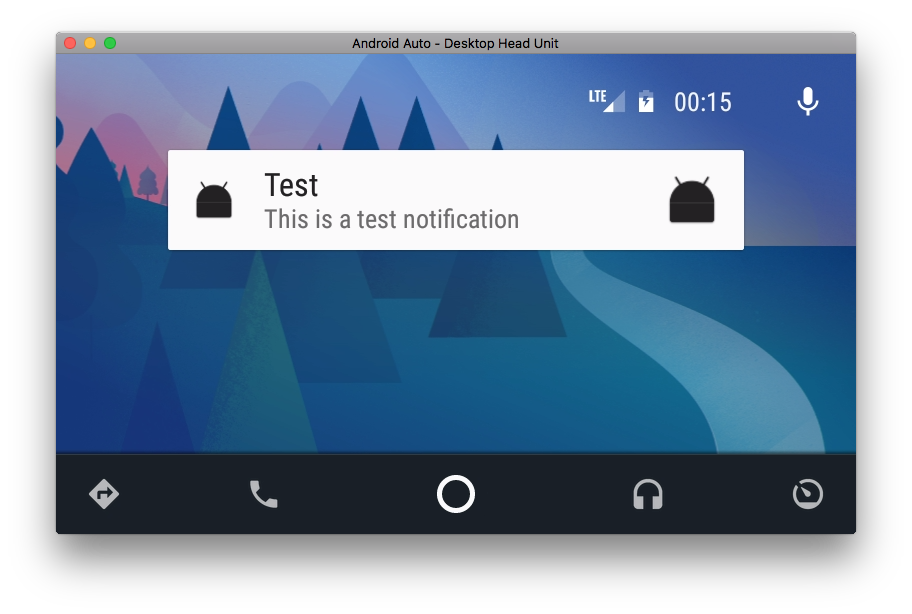
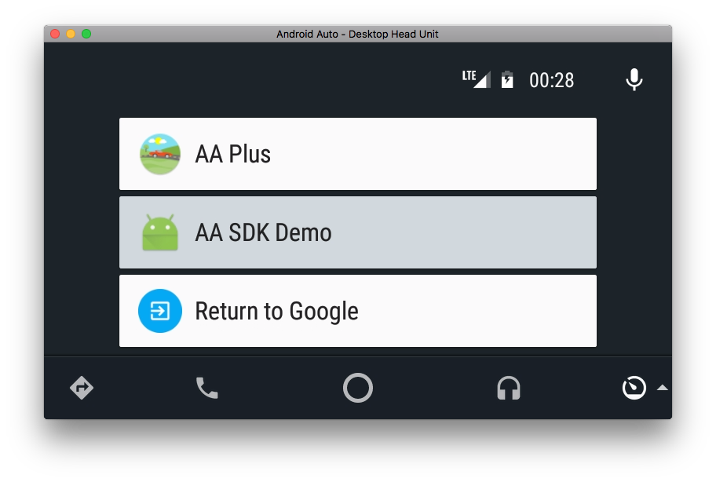

# aauto-sdk-demo

A demo application for ``martoreto/aauto-sdk``.

## How to run it?

Well, you probably need to enable _unknown sources_ in Android Auto
developer settings, see [the official documentation](https://developer.android.com/training/auto/testing/index.html).

## Screenshots

